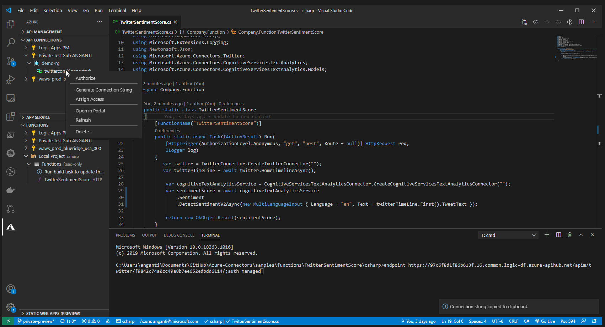

# API Connections in Deployed Code
Follow these instructions to use Azure API Connections in code deployed to Azure. Complete the [Quickstart](./QUICKSTART.md) instructions  before continuing on.

At a high-level, you will:
- Deploy your code to Azure
- Enable Managed Identity on the resource
- Assign access to your API Connection

## Deploy code to Azure
### Azure Functions
A simple way to deploy code to Azure is through an Azure Function. Follow [instructions here to publish your Function App to Azure](https://docs.microsoft.com/azure/azure-functions/functions-create-first-function-vs-code?pivots=programming-language-javascript). Once you've deployed your Azure Function, make sure that the relevant environment variables you used locally (in `local.settings.json`) are reflected in your deployed app's [App Settings](https://docs.microsoft.com/en-us/azure/azure-functions/functions-how-to-use-azure-function-app-settings).

### App Service
You can also [deploy a Node.js web app to App Service](https://docs.microsoft.com/en-us/azure/app-service/quickstart-nodejs?pivots=platform-linux) or [deploy a .NET Core web app to App Service](https://docs.microsoft.com/azure/app-service/quickstart-dotnetcore?pivots=platform-linux). Once you've deployed your Azure Function, make sure that the environment variables you used locally are in your deployed app's [App Settings](https://docs.microsoft.com/azure/app-service/configure-common).

## Enable System Assigned Managed Identity
Give your deployed resource a 
system assigned Managed Identity by following [these instructions]((https://docs.microsoft.com/azure/app-service/overview-managed-identity)).

## Assign Access
Navigate to the "Azure" extension and find the "API CONNECTIONS" tab.

Right-click the API Connection you want to use in your deployed code choose "Assign Access." Select the name of the resource that you deployed your code to.

The gif below shows these steps in action.

