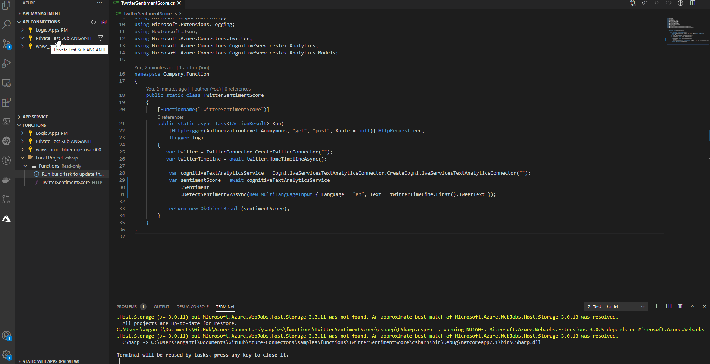
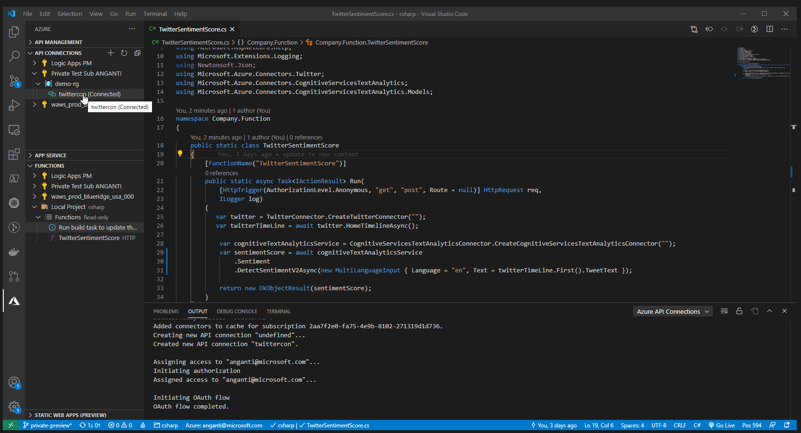

# Getting Started

Follow these instructions to create Azure API Connections and use the appropriate Azure connectors SDK. At a high-level, you will:
1. Install the Azure API Connections VS Code Extension
2. Install the connectors sdk
3. Create a connection
4. Use the SDK

## Prerequisites
- [Visual Studio Code](https://code.visualstudio.com/Download)
- Azure account
  - [Create a free Azure account here](https://azure.microsoft.com/free/) or
  - [Login with GitHub and a free trial here](https://azure.microsoft.com/products/github/)
- [Azure CLI](https://docs.microsoft.com/en-us/cli/azure/install-azure-cli?view=azure-cli-latest) (_temporary requirement_)
  - After installing the Azure CLI, sign in by running `az login`

## Install the Azure API Connections VS Code Extension
Download extension .vsix from [Here](https://aka.ms/vscode-azcon-ext). Install the VS Code Extension following these short [instructions to install an extension from a VSIX](https://code.visualstudio.com/docs/editor/extension-gallery#_install-from-a-vsix)

## Install a connectors SDK
You can explore all currently available connector SDK's [on this repo itself](https://github.com/Azure/Connectors/packages). Note that we have not generated SDK's for all connectors while we are in private preview. Please file or upvote an issue to see your favorite connector.

For more information on the connector Actions that are available, see the [Connectors reference documentation](https://docs.microsoft.com/connectors/connector-reference/). You can also explore [in depth how-to guides for some connectors like Bing Search](https://docs.microsoft.com/en-us/azure/connectors/connectors-create-api-bingsearch
).

### Set up Azure GitHub package registry
**You will need to perform a one-time setup to store the Azure GitHub package registry as source.** This is only a requirement while we are in private preview.

<details><summary>JavaScript / TypeScript npm instructions</summary>
<p>

To authenticate to GitHub Packages to use with npm:
1. [Create GitHub Personal Access Token(PAT)](https://docs.github.com/en/github/authenticating-to-github/creating-a-personal-access-token)
    - enable **read:packages** and **repo** permission
2. Authenticate by logging in to npm using the `npm login` command. When prompted, enter your GitHub username for `Username`, your personal access token for `Password`, and your public email address for `Email`:
```
$ npm login --registry=https://npm.pkg.github.com
Username: <USERNAME>
Password: <TOKEN>
Email: <PUBLIC-EMAIL-ADDRESS>
```

</p>
</details>

<details><summary>C# Nuget instructions</summary>
<p>

To authenticate to GitHub Packages to use with NuGet:
- [Create GitHub Personal Access Token(PAT)](https://docs.github.com/en/github/authenticating-to-github/creating-a-personal-access-token)
    - enable **read:packages** permission
- Locally run command 
    > dotnet nuget add source https://nuget.pkg.github.com/Azure/index.json --name AzureGPR --username **<GitHubUserName>** --password **<PAT>** --store-password-in-clear-text

</p>
</details>

### Install an SDK

<details><summary>JavaScript / TypeScript install instructions</summary>
<p>

First, create an `.npmrc` file in the same directory as your `package.json`. This file should contain the following contents:
```
registry=https://npm.pkg.github.com/Azure
```

Then, install the connector you want to use. For example:
> npm install @azure/microsoftteams-connector

</p>
</details>

<details><summary>C# install instructions</summary>
<p>

Install the connector you want to use. For example:
> dotnet add package Azure.Connectors.MicrosoftTeams --version 0.0.4-alpha

</p>
</details>

## Create a connection
Navigate to the "Azure" extension and find the "API CONNECTIONS" tab. Sign in using your Azure Credentials, if necessary.

Right-click the subscription you want to use, click "Create API Connection...", and follow creation prompts from here.

The gif below shows these steps in action.



## Use the SDK
All connector SDK's follow a similar factory pattern to create the connector client object.

<details><summary>JavaScript / TypeScript code example</summary>
<p>

```typescript
import { createMicrosoftTeamsConnector } from "@azure/microsoftteams-connector"

const getTeams = async function (): Promise<void> {
    const teamsClient = await createMicrosoftTeamsConnector("<ConnectionStringFromVSCodeExtension>");
    const myTeams = await teamsClient.getAllTeams();
    console.log(myTeams);
}
```

</p>
</details>

<details><summary>C# code example</summary>
<p>

```csharp
using Azure.Connectors.MicrosoftTeams;
using Azure.Connectors.TextAnalytics;

var teamsConnector = MicrosoftTeamsConnector.Create("");
var teams = await teamsConnector.GetAllTeamsAsync();
var team = teams.Value.FirstOrDefault(t => t.DisplayName.Equals("My Group Name"));
var channels = await teamsConnector.GetChannelsForGroupAsync(team.Id);
var channel = channels.Value.FirstOrDefault(c => c.DisplayName.Equals("Channel Name"));

var messages = await teamsConnector.GetMessagesFromChannelAsync(team.Id, channel.Id);
var lastMessage = messages.Value.First();

var cognitiveTextAnalyticsService = TextAnalyticsConnector.Create("");
var sentimentScore = await cognitiveTextAnalyticsService.Sentiment.DetectSentimentV2Async(new MultiLanguageInput { Language = "en", Text = lastMessage.Body.Content });
Console.WriteLine(sentimentScore)
```

</p>
</details>

To run the code from each example, replace `<ConnectionStringFromVSCodeExtension>` with a generated connection string. To generate a connection string, go back to the connector connection you made through the VS Code Extension. Right click that connection and click "Generate Connection String". We recommend that you choose `Managed Identity` for your authentication type. You may have to choose `Key` if the environment you are deploying to does not support [Managed Identity](https://docs.microsoft.com/en-us/azure/active-directory/managed-identities-azure-resources/overview). 

If you generate using `Key`, please be very careful to not expose this connection string to anyone. Access to this connection string gives anyone access to your resources.

We also recommend that you do not hard-code the connection strings and reference them as environment variables instead.

The gif below shows these steps in action.



## Next Steps...
### Deploy
To use API connections in your deployed code, follow along these instructions to [deploy to Azure.](./DEPLOY.md)
