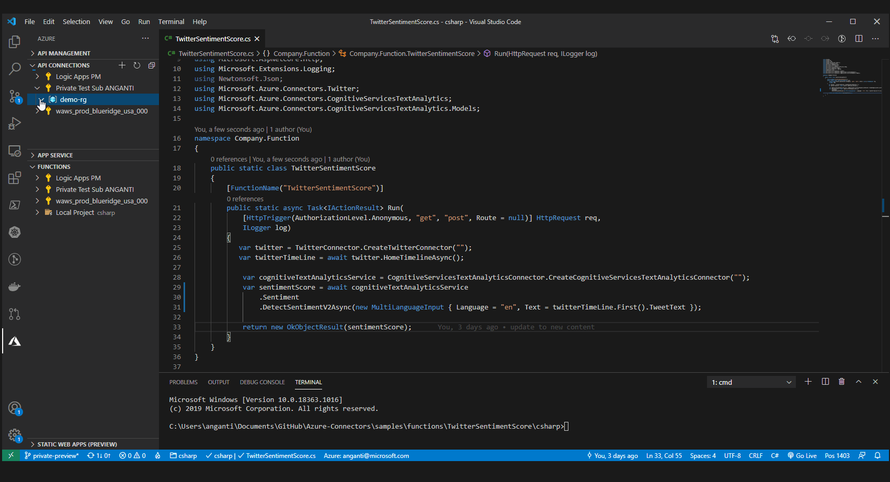

# VSCode Extension for API Connections :loudspeaker:
- Download extension .vsix from [Here](https://aka.ms/vscode-azcon-ext).
- Install the VS Code Extension following these short [instructions](https://code.visualstudio.com/docs/editor/extension-gallery#_install-from-a-vsix).

- Main Features:
    1. Create API Connections for all the logic apps supported [Azure Connectors](https://docs.microsoft.com/en-us/connectors/connector-reference/connector-reference-logicapps-connectors).
    2. Authorize API Connection
        1. OAuth consent flows for connectors like dropbox, twitter, office365 etc
        2. Specify API Key for connectors like azure storage. 
    3. Generate connection string, to be used to invoke API Connections.
    4. Navigate to API Connections in Azure Portal. 
    5. Assign webapp/functionapp managed identity access to connection.
    6. Delete API Connection.
    7. Locally invoke connections using connectionkeys (or) managed identity (baked into the connectors sdk's)

    **Create API Connection**
    

    **Assign access to API Connection**

        Local vscode identity is automatically assigned when connection is created. 
        Use this option when you would want to assign access to a web app or function app
        The webapp or function app must have system assign identity enabled or user assigned identity set to show up in the list 
    
    
    **Generate API Connection String**

        Keys can easily be compromised and have limited time validity. 
        Recommended: "Managed Identity" option.
    
    
    **Invoke Connection**

        If invoking connection locally using Managed Identity, 
            Make sure you have [az cli](https://aka.ms/azcli) installed 
            and ran command 'az login'
        
        If invoking connection in the cloud using Managed Identity,
            Make sure the Function App "System Assigned Identity" is enabled
            and the Function App is given access to the connection (using Assign Access command)
    
